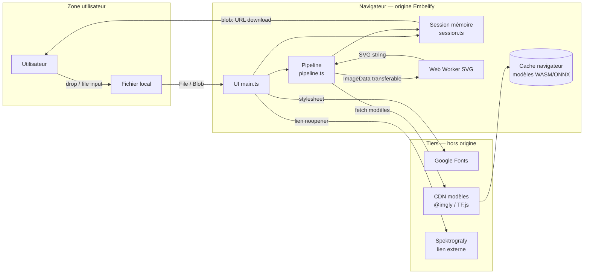

# Embelify — Threat Model

**Version :** 1.1  
**Date :** 2026-07-19  
**Périmètre :** application web Embelify telle qu’implémentée aujourd’hui (pipeline client-side) + surfaces prévues (auth / crédits Supabase).  
**Méthode :** inventaire des actifs → flux de données → frontières de confiance → STRIDE → risques & contrôles.

### Correctifs appliqués (v1.1)

| ID | Mitigation | Statut |
|----|------------|--------|
| X1 | Preview SVG via `` (plus d’`innerHTML`) | **Fait** |
| D1 / X2 | Gate fichier 25 Mo + MIME + magic bytes + decode | **Fait** |
| T3 | Polices self-host (`@fontsource`) | **Fait** |
| CSP / headers | `securityHeaders.ts` + `public/_headers` | **Fait** |
| T2 / X3 | Allowlist CSP `connect-src` → `staticimgly.com` (vendor ~285 Mo reporté) | **Partiel** |

---

## 1. Résumé exécutif

Embelify est une SPA Vite/TypeScript qui traite des images **uniquement dans le navigateur** : upscale (UpscalerJS / TensorFlow.js), détourage (chroma local ou `@imgly/background-removal` / ONNX), vectorisation SVG (ImageTracer dans un Web Worker). La livraison est un **téléchargement** ; aucune image utilisateur n’est envoyée à un serveur Embelify.

**Profil de risque actuel :** faible côté fuite serveur (pas de backend), **modéré** côté intégrité/confiance (CDN, dépendances npm, XSS via prévisualisation SVG) et **modéré** côté disponibilité client (DoS mémoire / GPU via images volumineuses ou modèles lourds).

**Risque futur (auth + crédits) :** élévation nette — compte, paiements, quotas, SSO Spektrografy — à remodéliser avant mise en production.

---

## 2. Architecture & flux de données

### Propriétés de session (contrôles existants)

| Contrôle | Emplacement | Effet |
|----------|-------------|--------|
| État uniquement en mémoire | `src/lib/session.ts` | Pas de `localStorage` / IndexedDB pour les assets |
| Wipe à la fermeture | `pagehide` / `beforeunload` / `freeze` | Réduit la persistance inter-onglets / bfcache |
| Caps taille | `MAX_INPUT_EDGE=2048`, `MAX_OUTPUT_PIXELS≈12M` | Limite DoS mémoire |
| Worker + timeout 60s | `rasterToSvgInWorker` | Isole la vectorisation ; coupe les runs trop longs |
| COOP / COEP | `vite.config.ts` (dev/preview) | Prérequis WASM/threads ; à reproduire en prod |

---

## 3. Actifs

| ID | Actif | Classification | Notes |
|----|--------|----------------|-------|
| A1 | Images source & résultats | Confidentiel (utilisateur) | Logos, photos, éventuellement données sensibles |
| A2 | Promesse « jamais uploadé / stocké » | Réputation / conformité | Affirmée UI, README, CGU |
| A3 | Intégrité du pipeline & des modèles | Intégrité | Altération → résultats trompeurs ou code malveillant |
| A4 | Disponibilité du traitement local | Disponibilité | GPU/CPU/RAM du client |
| A5 | Marque Embelify / lien Spektrografy | Confiance | Phishing / domaine frère |
| A6 | *(futur)* Comptes, crédits, secrets API | Critique | Hors scope runtime actuel |

---

## 4. Acteurs de menace

| Acteur | Motivation | Capacité |
|--------|------------|----------|
| Utilisateur malveillant / curieux | Abuser des ressources, contourner CGU | Navigateur local, fichiers arbitraires |
| Attaquant web (XSS / supply chain) | Exfiltrer images en session, pivot | Compromis CDN / npm / XSS |
| Concurrent / fraudeur *(futur)* | Vol de crédits, abus de compte | API auth, automation |
| Opérateur CDN / dépendance | Compromission supply chain | Distribution modèles / polices |

---

## 5. Frontières de confiance

1. **Utilisateur ↔ application** — le fichier n’est pas de confiance (type MIME, contenu, taille).
2. **Origine Embelify ↔ CDN externes** — polices Google ; téléchargement des poids ONNX / WASM via la lib rembg.
3. **Thread principal ↔ Web Worker** — messages structurés ; le SVG renvoyé n’est pas de confiance pour l’injection HTML.
4. **Embelify ↔ Spektrografy** — domaines distincts ; pas de cookies partagés aujourd’hui.
5. ***(futur)* Embelify ↔ Supabase** — auth, RLS, secrets ; nouvelle frontière critique.

---

## 6. Analyse STRIDE

Légende risque : **C**ritique · **H**aut · **M**oyen · **B**as.

### 6.1 Spoofing (usurpation)

| ID | Scénario | Risque | Contrôles actuels | Recommandations |
|----|----------|--------|-------------------|-----------------|
| S1 | Page phishing imitant Embelify pour voler des images | M | Marque + CGU | HSTS, domaine officiel documenté, évent. SRI / CSP `frame-ancestors` |
| S2 | *(futur)* Usurpation de session Auth | — | N/A | Cookies `Secure`/`HttpOnly`/`SameSite`, MFA optionnelle |

### 6.2 Tampering (altération)

| ID | Scénario | Risque | Contrôles actuels | Recommandations |
|----|----------|--------|-------------------|-----------------|
| T1 | Compromission npm (`upscaler`, `@imgly/background-removal`, `onnxruntime-web`, …) | H | lockfile | `npm audit`, pin versions, CI SBOM, revue des maj majeures |
| T2 | CDN modèles rembg sert des poids altérés | H | HTTPS implicite | Héberger / mirroir les modèles sur origin Embelify + hash/SRI ; CSP `connect-src` restrictif |
| T3 | CDN Google Fonts altéré / MITM | M | HTTPS | Self-host des polices ; retire une dépendance runtime |
| T4 | Altération du build déployé (hébergeur) | M | — | CI signée, headers sécurité, monitoring d’intégrité |

### 6.3 Repudiation

| ID | Scénario | Risque | Contrôles actuels | Recommandations |
|----|----------|--------|-------------------|-----------------|
| R1 | Aujourd’hui : peu de logs serveur (pas de backend) | B | N/A | OK pour le modèle privacy-first |
| R2 | *(futur)* Contestation d’usage de crédits | — | N/A | Audit trail serveur (sans stocker les images) |

### 6.4 Information disclosure (fuite)

| ID | Scénario | Risque | Contrôles actuels | Recommandations |
|----|----------|--------|-------------------|-----------------|
| I1 | Upload serveur involontaire | B | Pipeline 100 % client ; pas d’API upload | Garder l’absence d’endpoint ; tests de non-régression réseau |
| I2 | Fuite via XSS (exfil `blob:` / canvas) | H | COOP/COEP en dev | Voir X1 ; CSP stricte ; ne pas injecter le SVG en HTML brut |
| I3 | Persistance accidentelle (bfcache, DevTools, extensions) | M | `wipeSession` sur `pagehide` | Documenter les limites (extensions, captures écran) ; ne pas promettre l’impossible |
| I4 | Cache modèles ≠ données utilisateur | B | Commentaire explicite dans `wipeSession` | Clarifier dans CGU / UI |
| I5 | Préférence langue dans `localStorage` | B | Clé non sensible | OK |
| I6 | Telemetry des libs ML vers des tiers | M | Non audité ici | Vérifier les fetches de `@imgly` / TF.js ; bloquer via CSP si besoin |

### 6.5 Denial of service

| ID | Scénario | Risque | Contrôles actuels | Recommandations |
|----|----------|--------|-------------------|-----------------|
| D1 | Image géante → OOM / freeze onglet | M | Downscale 2048 ; cap pixels sortie | Valider taille fichier (ex. 25 Mo) **avant** decode ; désactiver submit si trop gros |
| D2 | Spam de runs live (debounce 220 ms) | B | Debounce + abort | Garder ; éventuellement file d’attente unique plus stricte |
| D3 | Vectorisation pathologique | M | Timeout worker 60s | Réduire caps si SVG ; progress cancel UI |
| D4 | *(futur)* Abus API crédits | — | N/A | Rate limit, captcha, quotas serveur |

### 6.6 Elevation of privilege

| ID | Scénario | Risque | Contrôles actuels | Recommandations |
|----|----------|--------|-------------------|-----------------|
| E1 | Aujourd’hui : pas de rôles | B | App stateless | — |
| E2 | *(futur)* Escalade crédits / admin Supabase | — | N/A | RLS stricte, service role hors client, webhooks signés |

---

## 7. Menaces applicatives spécifiques

### X1 — XSS via prévisualisation SVG *(mitigé)*

**Flux historique :** `ImageTracer` → chaîne SVG → `innerHTML`.

**Mitigation :** `showSvgPreview` affiche uniquement via `` (`main.ts`). Les scripts SVG ne s’exécutent pas dans ce contexte. CSP + smoke test anti-injection DOM.

| Contrôle | Statut |
|----------|--------|
| Affichage `` | Fait |
| CSP (`securityHeaders.ts`, `public/_headers`) | Fait |
| Smoke : aucun `<svg>` injecté dans le DOM preview | Fait |

### X2 — Contournement de `accept` sur l’input fichier

L’attribut `accept` est un filtre UI uniquement. Un fichier non-image ou un polyglot peut être fourni.

| Contrôle proposé | Détail |
|------------------|--------|
| Validation runtime | Après `createImageBitmap`, rejeter les échecs ; vérifier `file.type` + magic bytes basiques |
| Pas d’exécution de formats riches | Ne jamais traiter SVG/HTML uploadés comme document (liste actuelle : png/jpeg/webp/gif/bmp — à renforcer) |

### X3 — Supply chain modèles & WASM

`@imgly/background-removal` et `onnxruntime-web` téléchargent des artefacts au runtime. Compromission = code natif WASM dans le navigateur.

| Contrôle proposé | Détail |
|------------------|--------|
| Pin + vendor | Versions lockfilées ; idéalement assets servis depuis l’origine Embelify |
| Subresource Integrity / hash | Vérifier les checksums des `.onnx` / `.wasm` |
| CSP `connect-src` | Liste blanche des hosts de modèles |

### X4 — Confusion privacy / caches

La session utilisateur est éphémère, mais les **modèles** restent en cache navigateur. Risque de malentendu (pas une fuite d’image, mais une promesse trop large).

| Contrôle proposé | Détail |
|------------------|--------|
| Messaging | Distinguer « images » vs « modèles » dans UI / CGU (déjà partiellement vrai) |

### X5 — Lien sœur Spektrografy

Lien `target="_blank"` avec `rel="noopener noreferrer"` : correct. Le risque principal est le phishing de domaine ou une future intégration SSO mal conçue.

---

## 8. Matrice de risques (état actuel)

| ID | Menace | Impact | Probabilité | Niveau | Priorité mitigation |
|----|--------|--------|-------------|--------|---------------------|
| X1 | XSS SVG preview | Élevé | Faible (mitigé) | **Bas** | Fait |
| T1/T2/X3 | Supply chain npm/CDN modèles | Élevé | Faible–Moyenne | **Moyen** | CSP allowlist ; vendor optionnel |
| D1 | DoS mémoire client | Moyen | Faible (25 Mo + caps) | **Bas** | Fait |
| I3/X4 | Persistance / confusion privacy | Moyen | Faible | **Moyen** | P2 |
| T3 | Fonts CDN | — | — | **Résolu** | Self-host |
| I1 | Upload serveur | Élevé | Très faible | **Bas** | Surveiller |

---

## 9. Hypothèses & hors scope

**Hypothèses**

- Pas de backend Embelify en production aujourd’hui.
- L’utilisateur fait confiance à son navigateur et à son poste (malware local hors scope).
- Les CGU interdisent les usages illégaux ; l’app ne fait pas de modération de contenu côté serveur.

**Hors scope (à threat-modéliser séparément)**

- Paiement / Stripe, KYC.
- Infrastructure Spektrografy (Railway) et partage d’identité.
- CI/CD et secrets GitHub (sauf impact sur l’intégrité du build).

---

## 10. Roadmap contrôles recommandés

### P0 — avant exposition large

1. ~~Corriger l’affichage SVG~~ **Fait** (`blob:` ``).
2. ~~CSP + headers~~ **Fait** (Vite + `public/_headers`).
3. ~~Inventorier hosts modèles~~ **Fait** (`staticimgly.com` en allowlist CSP).

### P1 — durcissement

4. ~~Limite taille fichier~~ **Fait** (25 Mo + messages i18n).
5. ~~Self-host polices~~ **Fait** ; modèles ONNX/WASM : rester sur CDN (package ~285 Mo) ou mirroir dédié plus tard.
6. `npm run audit` disponible ; brancher en CI au déploiement.

### P2 — produit & futur

7. Clarifier privacy copy (images vs caches modèles).
8. Avant auth/crédits : nouveau threat model (STRIDE + abus économique + RLS Supabase).
9. Préférer org Supabase partagée (comme noté dans le README) avec séparation claire des secrets par produit.

---

## 11. Cas d’abus & tests de sécurité suggérés

| Test | Objectif |
|------|----------|
| SVG malveillant généré / injecté dans le chemin preview | Confirmer absence d’exécution JS |
| Fichier 100+ Mo / image 20k×20k | Comportement contrôlé (refus ou downscale) |
| Blocage réseau des CDN modèles | Dégradation gracieuse, pas de fuite d’image |
| Inspection DevTools Network pendant un run | Aucun upload de l’image utilisateur |
| Headers prod | COOP/COEP/CSP présents |
| *(futur)* Token volé / IDOR crédits | RLS + tests d’authz |

---

## 12. Révision

| Quand | Action |
|-------|--------|
| Ajout d’un backend, analytics, ou auth | Mettre à jour ce document (nouvelle frontière) |
| Changement de lib ML / CDN | Revoir T2 / X3 |
| Revue trimestrielle | Revalider la matrice et les P0 ouverts |

**Owner suggéré :** mainteneur Embelify (aligné Spektrografy / même organisation).
